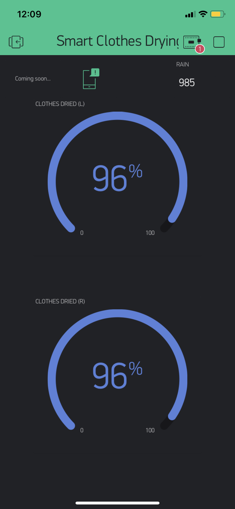
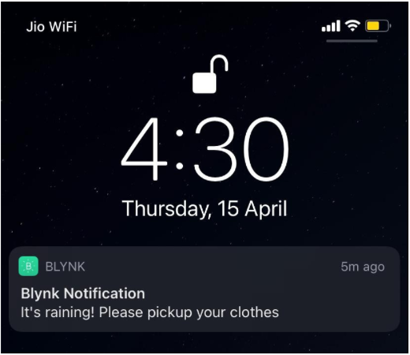
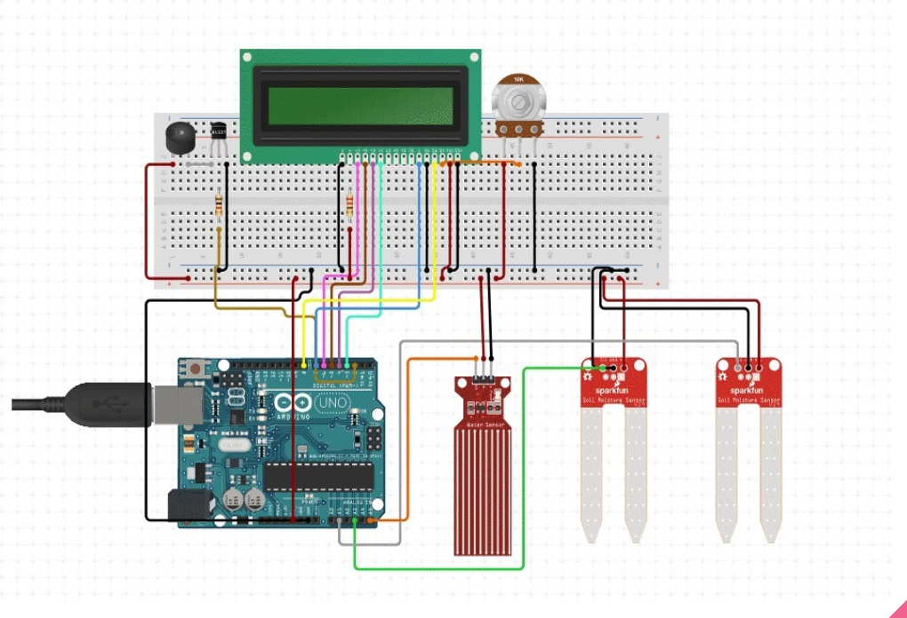
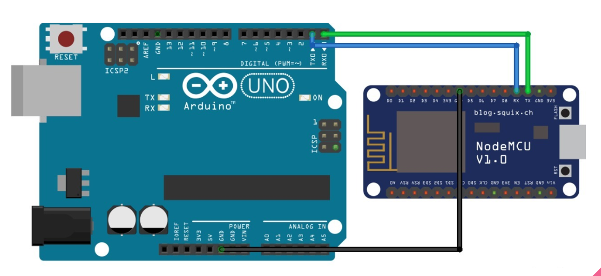

# Smart Clothes Drying Stand
I have made a “SMART CLOTHES DRYING STAND” which checks the moisture content in the clothes hanged out to dry with the help of moisture sensors and updates the percentage of clothes have dried on your phone. We have also attached a rain sensor which sends an alert in case it rains and a buzzer which rings for 10 seconds when it rains. We have also added a LCD screen which too can be used for live stats.

## What was it's need?
One of the major problems we PG and hostel residents face is taking care of the clothes hung on the terrace or out to dry. We often have to go and check the status of our clothes so as not to leave our special shirts in the sunlight for too long and ruin it forever. 
The main problem is the sun bleaches colour out of our clothes given time. If we leave a colored cloth folded over a line for a while, when we pick it up we see the top is lighter and usually where the string was there is a darker line.
And if it rains then all our hard work is ruined and we have to go through the whole process of washing all over again. 

## How it works?

I have used two separate boards in the project: NodeMCU and Arduino UNO each having its separate code. On the sensor part we have used three sensors: two moisture sensors and one rain sensor.
All the three sensors are connected to the Arduino UNO board and it collects them and do the necessary calculations for them to be useful for the user and displays the results on LCD. It concatenates all the values in a char array separating each with a comma and this string is sent to the NodeMCU board.
NodeMCU collects this string and separates the values again into three different integer values. It then connects with the wifi and initialises the app connection.
After a connection has been established the values are sent to the mobile application as required. 
The values received on the application are displayed in the configured widgets and notifications.

## Video Link

https://drive.google.com/file/d/1zAhRwYS52DuQQ4mJqnZp5l3rakQTClac/view?resourcekey

## Pictures

## Schematics

